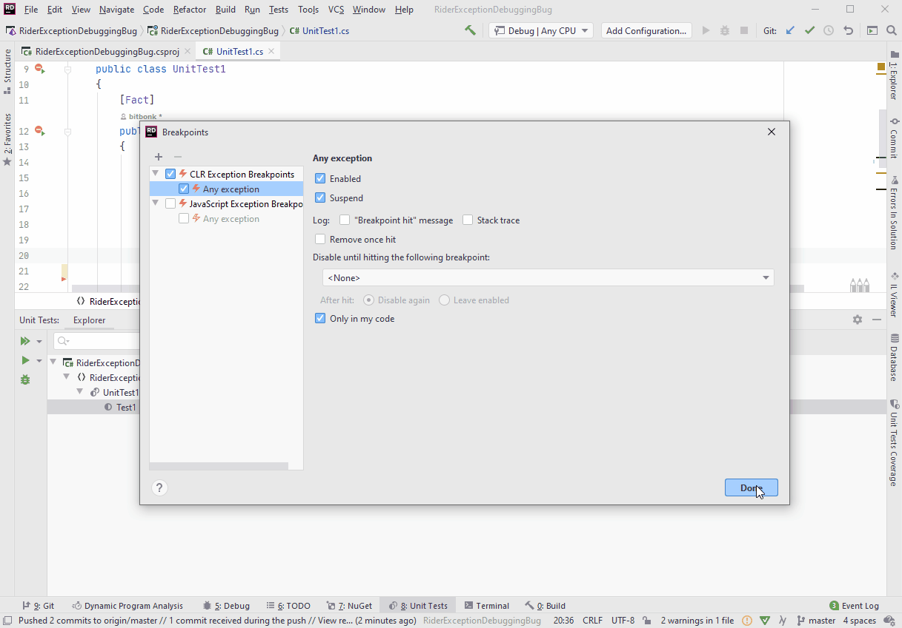

# RiderExceptionDebuggingBug
Project to reproduce missing first chance exception popups in Rider

When I debug the only test in the project and the Exception occurs, I do not get an exception popup, i.e. the debugger does not break at the exception.

